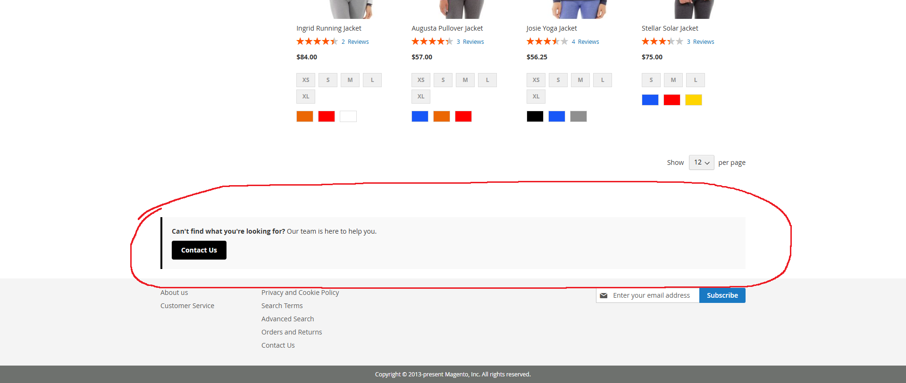

# 🛒 Magento 2 Category Bottom Description Extension (FREE)

The **Magento 2 Category Bottom Description** module by SamuelBSource adds a new 📝 WYSIWYG-enabled attribute to product categories called `Bottom Description`. This content is displayed below the main content on the category view page — great for SEO or promotional content.

---

## 📚 1. Documentation

- 📥 [Installation Guide](#3-how-to-install-category-bottom-description-extension)
- 📘 [User Guide](#4-highlight-features-of-category-bottom-description)
- 🔧 [Contribute on GitHub](https://github.com/samuelbsource/module-bottom-description)
- ❓ [Get Support](https://github.com/samuelbsource/module-bottom-description/issues)

---

## 🛠️ 2. How to install Category Bottom Description extension for Magento 2

### 📦 Install via Packagist (recommended)

```bash
composer require samuelbsource/module-bottom-description
bin/magento module:enable SamuelBSource_BottomDescription
bin/magento setup:upgrade
bin/magento cache:flush
```

### 🐙 Install via GitHub (VCS)

Add the repo to your `composer.json`:

```json
"repositories": [
{
"type": "vcs",
"url": "https://github.com/samuelbsource/module-bottom-description"
}
]
```

Then run:

```bash
composer require samuelbsource/module-bottom-description:dev-main
bin/magento setup:upgrade
bin/magento cache:flush
```

### 🧱 Manual installation

```bash
git clone https://github.com/samuelbsource/module-bottom-description.git app/code/SamuelBSource/BottomDescription
bin/magento module:enable SamuelBSource_BottomDescription
bin/magento setup:upgrade
bin/magento cache:flush
```

---

## ✨ 3. Highlight Features of Category Bottom Description

### ➕ Adds New Attribute to Categories

A new `bottom_description` attribute is added to all product categories.

- 🏷️ Store-view scoped
- 📝 Fully WYSIWYG-enabled
- 📄 The content is injected right after the "columns" element

## 🧪 4. How to Use Category Bottom Description

### ⚙️ Admin Configuration

1. Go to **Catalog > Categories**
2. Open or create a category
3. Under **General Information**, fill in the **Bottom Description** field
4. Save the category

### 👀 Frontend Output

Visit the category page on the frontend. You’ll see the **Bottom Description** appear below the category content and product listing, inside a `<div class="category-bottom">`.


 You’ll see the **Bottom Description** appear below the category content and product listing, inside a `<div class="category-bottom">`.

---

## 🎨 5. Customization Options

### 🖌️ Change the Template

Override this file in your custom theme to control rendering:

```
view/frontend/templates/category/bottom_description.phtml
```

Example location in theme:

```
app/design/frontend/Vendor/theme/SamuelBSource_BottomDescription/templates/category/bottom_description.phtml
```

### 🧩 Adjust Position with Layout XML

Override `catalog_category_view.xml` to reposition or restyle the block.

---

## ✅ 6. Compatibility

- 🧱 Magento Open Source 2.4.x
- 💼 Magento Commerce 2.4.x
- 🐘 PHP 8.\*

---

## 📄 7. License

Released under the [Apache License 2.0](https://www.apache.org/licenses/LICENSE-2.0).

---

## 👤 8. Author

**Samuel Boczek**
Magento Developer / AI Student / Freelancer
- 🐱 GitHub: [@samuelbsource](https://github.com/samuelbsource)
- 💼 LinkedIn: [linkedin.com/in/samuel-boczek](https://www.linkedin.com/in/samuel-boczek/)

---

**🚀 More Magento 2 modules coming soon!**

